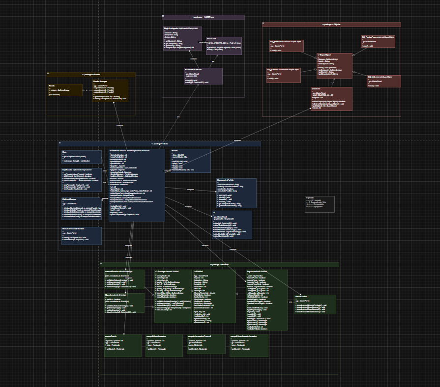

# El Viaje del Héroe

Juego 2D de aventura y combate por turnos desarrollado en Java con Swing. El jugador es  un sencillo campesino que se adentra en un castillo enemigo con la armadura vieja de su familia, para recuperar el cofre del tesoro del rey, enfrentándose a un samurái errante y a un gigante jefe final que se encuentran junto al castillo.

## Descripción del juego

El mayor enemigo del reino ha asaltado el castillo y se ha hecho con el cofre del tesoro del rey. Sin nadie dispuesto a hacerle frente, un simple campesino toma la antigua armadura familiar y su espada y se dirige al castillo para recuperar lo robado.

El juego se divide en tres escenas principales:

- Escena 1 — Exterior del castillo. El jugador camina hacia la puerta del castillo. El entorno es de desplazamiento lateral con animaciones de idle y movimiento.
- Escena 2 — Interior (sala del samurái). Tras entrar al castillo, el jugador se enfrenta al Samurái Errante en combate por turnos. Al vencerlo puede obtener una poción como botín y accede al siguiente piso.
- Escena 3 — Interior (sala del Gigante). Combate final contra el jefe. Una vez derrotado aparece el cofre del tesoro; al recogerse se llega a la pantalla de victoria.
### Sistema de combate por turnos

Cada combate alterna turnos entre el jugador y el enemigo. En su turno, el jugador elige entre:

| Acción                | Descripción |
|-----------------------|---|
| ATACAR -> SEGURO      | Daño bajo, probabilidad de acierto muy alta (92 %) |
| ATACAR -> EQUILIBRADO | Daño medio, probabilidad media (68 %) |
| ATACAR -> ARRIESGADO  | Daño alto, probabilidad baja (40 %) |
| INVENTARIO            | Usar una poción de vida o de fuerza |

Si el jugador falla un ataque contra el Samurái, este ejecuta automáticamente un contrataque. El Gigante, además, tiene una probabilidad del 25 % de stunear al jugador al acertar, saltándose el turno siguiente. Ambos enemigos activan una habilidad única (mejora permanente de fuerza) al caer por debajo de la mitad de su vida.

Los enemigos también eligen entre tres tipos de ataque de forma aleatoria en cada turno.

## Controles

| Tecla | Acción |
|---|---|
|A /D | Mover al jugador (izquierda / derecha) |
| E | Interactuar (entrar puertas, iniciar combate, recoger cofre) |
| W / S | Navegar menús y opciones de combate |
| Enter | Confirmar selección |
| P | Pausar / reanudar la partida |
| O | Abrir menú de opciones (pantalla completa / salir) |
| Esc | Volver atrás en submenús de combate o inventario |

## Organización del código

El código fuente vive en src/ y se organiza en cinco paquetes. Cada paquete encapsula una responsabilidad concreta.

- La carpeta src se divide en varios paquetes según la responsabilidad de cada parte del juego.
- El paquete Main reúne el núcleo de la aplicación, incluyendo la ventana principal, el game loop, la gestión del teclado, el sonido y la interfaz gráfica.
- En Entidad se encuentran las clases relacionadas con el jugador, los enemigos, las zonas de interacción y toda la lógica de combate.
- El paquete Fondo se encarga de la carga y renderizado de los escenarios y fondos multicapa.
- Objetos contiene el sistema de inventario y los distintos objetos utilizables durante la partida.
- Por último, HallOfFame administra el ranking persistente de jugadores utilizando almacenamiento en formato XML.

### Paquete Main
Contiene el núcleo del motor: arranque de la ventana, game loop, captura de teclado, audio e interfaz de usuario.

#### Main
Punto de entrada del programa. Crea el JFrame principal, obtiene el GraphicsDevice del sistema (necesario para el modo pantalla completa) y arranca el GamePanel.

#### GamePanel
Es la clase central del proyecto. Extiende JPanel e implementa Runnable para ejecutar el game loop en su propio hilo. Sus responsabilidades son:

- Game loop basado en delta-time (run()): mantiene la tasa de actualización a 54 FPS independientemente del hardware.
- Estado global: define todas las constantes de estado del juego (titleState, escenaState1/2/3, pauseState1/2/3, statePelea, statePelea2, congratulationsState, hallOfFameState) y el estado actual gameState.
- Doble buffer : en paintComponent() dibuja primero en un BufferedImage en memoria y luego lo escala y centra en la pantalla real, lo que elimina el parpadeo y permite el soporte de pantalla completa con escala proporcional.
- Creacion : mantiene referencias a todos los subsistemas (keyH, cChecker, sound, ui, fondoM, at, inventario, cronometro, pantallaHallOfFame) y a las entidades (jugador, samuraiErrante, gigante, enemigoActual).

#### KeyHandler
Implementa KeyListener y traduce las pulsaciones de teclado en acciones según el estado activo. Gestiona la navegación de menús, el sistema de combate por turnos (selección de ataque, uso de inventario y confirmación de resultados), la pausa, las opciones y el guardado del registro al llegar a la pantalla de victoria.

#### ColisionChecker
Comprueba la intersección entre el hitbox del jugador (Rectangle devuelto por getBorde1/2/3()) y los rectángulos de interacción del mapa. Tiene un método por cada zona: puerta, zona de pelea 1, zona de pelea final, acceso al piso 3 y zona de enhorabuena.

#### Sonido
Precarga en el constructor todos los clips de audio (música de fondo y efectos de sonido) en un array Clip[30]. Expone tres métodos: playMusic (bucle infinito, detiene la pista anterior), stopMusic y playSE (efecto puntual, no en bucle).

#### CronometroPartida
Mide el tiempo que el jugador tarda en completar el juego con una precisión de nanosegundos (System.nanoTime()). Funciona como un cronómetro real: arrancar() / pausar() / reanudar() / detener(). Acumula el tiempo en milisegundosAcumulados para sobrevivir a las pausas sin contar el tiempo detenido.

#### UI
Renderiza toda la interfaz de usuario en función de gameState: menú principal, historia, HUD de vida y cronómetro, menú de combate, panel de resultado de ataque, inventario, opciones, pantalla de muerte, pantalla de enhorabuena y Hall of Fame. Delega el dibujado del ranking en PantallaHallOfFame.

#### PantallaIntroducirNombre
Muestra un JDialog modal (bloquea el hilo de Swing hasta que el jugador confirma) donde el jugador escribe su nombre antes de empezar la partida. Si no escribe nada, el nombre por defecto es Anónimo.

### Paquete Entidad

Contiene toda la jerarquía de entidades del juego y las zonas de interacción del mapa.

#### Entidad (abstract)
Clase base de la que heredan Jugador y Enemigo. Centraliza los atributos comunes: vida, fuerza,fuerzaPorcentaje, flags de combate (heFallado, dañoHecho, fueAtaque, contrataquePendiente), sprites (caminar, idle, muerte, ataque) y contadores de animación. Implementa la lógica central de ataque (ejecutarAtaque) que calcula el daño con probabilidad de acierto y aplica recibirDaño al objetivo.

#### Enemigo (abstract) — extiende Entidad
Añade posición y tamaño en pantalla, sprites específicos de enemigos y flags de estado propios (enemigoYaAtaco, heMuertoEnemigo, seHaMostradoPantalla, isHabilidadActivada). Define la interfaz abstracta que todo enemigo debe implementar: updateEnemigo, drawEnemigo, animacionAtacar, animacionMuerte, actuar, activarHabilidadUnica y los métodos de comprobación de fin de animación. Los métodos contratacar, activarStun, fueStuneado y fueContrataque tienen implementación vacía por defecto; las subclases los sobreescriben solo si los necesitan.

#### Jugador — extiende Entidad
Mantiene tres pares de coordenadas independientes (una por escena) para que el jugador tenga posición propia en cada sala sin interferencias. Expone update1/2/3() y draw1/2/3() que se seleccionan desde GamePanel según gameState. Contiene toda la lógica de animación (movimiento, idle, ataque, muerte) y los métodos de combate que delegan en los de Entidad pasando gp.enemigoActual como objetivo .
#### samuraiErrante — extiende Enemigo
Primer enemigo del juego: 50 puntos de barra de vida, animación idle de 10 frames, ataque de 7 y muerte de 3. Implementa un contrataque cuando el jugador falla y una habilidad única que le sube la fuerza en 2 puntos al bajar de la mitad de vida.

#### Gigante — extiende Enemigo
Jefe final: 130 puntos de barra de vida, animación de ataque de 14 frames y muerte de 16. Sus particularidades son el stun (25 % de probabilidad de quitar el turno al jugador al acertar) y una habilidad única que le sube la fuerza en 3 puntos.

#### Actualizacion
Separa la lógica de actualización de GamePanel para no sobrecargarlo. Gestiona:
- actualizacionSistemaCombate(): flujo completo del combate (animaciones, cálculo de daño, comprobación de muerte, drops del enemigo, transiciones de estado).
- actualizacionIrEscena2/3(): detección de zona + pulsación de E + cambio de escena.
- actualizacionEmpezarPelea1/Final(): inicio del combate.
- actualizacionRecogerDrop(): recogida del objeto que dropeó el samurái.
- actualizacionMostrarEscenaCongratulations(): activación de la pantalla final.

#### Clases de zona de interacción
campoPuerta, campoPeleaInteraccion, campoIntercaccionEscena3 y campoEnhorabuenaInteraccion son simples contenedores de un Rectangle que representa el área de interacción en pantalla. ColisionChecker las instancia cada frame y comprueba intersección con el hitbox del jugador.

### Paquete Fondo

#### Fondo
Clase mínima: solo contiene un campo BufferedImage imagen. Se usa como ítem del array de capas.

#### FondosManager
Precarga en el constructor todas las imágenes PNG de fondo para las tres escenas desde el classpath. Cada escena se dibuja por capas superpuestas : 14 capas para la escena 1, 4 para la 2 y 5 para la 3. Los métodos draw1/2/3(Graphics2D) las pintan en el orden correcto (fondo -> primer plano).

### Paquete Objetos

#### SuperObject (abstract)
Base de todos los objetos. Define imagen, name y descripcion, el método abstracto usar() y los getters correspondientes.

#### Subclases de SuperObject

| Clase | Efecto de `usar()` |
|---|---|
| Obj_PocionVida | Recupera el 50 % de la vida máxima del jugador |
| Obj_PocionFuerza | Aumenta la fuerza del jugador en +5 durante un ataque |
| Obj_CofreTesoro | Decorativo; sin efecto (objeto visual del mapa) |
| Obj_Vida | Decorativo; se usa para extraer el icono de corazón del HUD |

#### Inventario
Lista de SuperObject con capacidad máxima de 20 slots. Tiene añadirObjeto, eliminarObjeto(index) y getObjeto(index). GamePanel lo instancia y UI lo lee para renderizar el panel de inventario en combate.

### Paquete HallOfFame

#### RegistroJugador
Clase inmutable (campos final) que representa una entrada del ranking: nombre, tiempo en milisegundos y fecha. Implementa Comparable<RegistroJugador> para que Collections.sort() pueda ordenarla de menor a mayor tiempo sin código adicional. Incluye el método getTiempoFormateado() que convierte milisegundos a MM:SS.mmm.

#### GestorXml
Clase con métodos estáticos que gestionan el archivo hall_of_fame.xml usando la API DOM de Java. La lógica de guardar() es adaptativa , es decir,  si el jugador ya tiene una entrada y su nuevo tiempo es mejor, actualiza el nodo existente; si es peor, no guarda nada; si es un jugador nuevo, añade una entrada nueva. cargarOrdenados() parsea el XML y devuelve la lista con cada registro o fila de datos de jugador.

#### PantallaHallOfFame
Renderiza la pantalla del ranking llamando a GestorXml.cargarOrdenados() y pintando hasta 10 entradas. La primera entrada aparece en dorado, la segunda en plateado y la tercera en bronce. La entrada del jugador que acaba de terminar la partida se resalta con un fondo rojo semitransparente.

## Aspectos investigados por libre

Estos elementos son los que fueron los que aprendi para que el juego  diere un gran cambio de avance en el diseño

### Game loop con delta-time
El método run() de GamePanel no usa Thread.sleep() fijo sino un acumulador de tiempo (delta) basado en System.nanoTime(). Esto garantiza que la lógica de juego se actualice exactamente a 54 FPS independientemente de la velocidad de la CPU. Este dato se podria crear la opcion de cambiarla desde el menu de opciones con facilidad, de manera que podrias limitar como quisieras el limite de fps. Con esto puedo controlar con bastante facilidad ya que tengo limitado cuando debe hacer el update y paint.

### Escalado y dibujado de pantalla completa
Se añadió un buffer manual en paintComponent(): toda la escena se dibuja primero en un BufferedImage off-screen y luego se escala con RenderingHints.VALUE_INTERPOLATION_BILINEAR al tamaño real de la pantalla. Esto permite que el juego se vea correctamente tanto en ventana como en modo pantalla completa GraphicsDevice.setFullScreenWindow(), calculando la escala proporcional mínima y centrando la imagen con offsets.

### Guardado de datos con XML (DOM API)
El Hall of Fame se guarda en un archivo hall_of_fame.xml usando la API DOM estándar de Java (DocumentBuilder, Document, Element, Transformer ) . Se investigó cómo parsear un XML existente, y su vez como crear un XML si no existe , usando primero DOM que va en memoria, modificar nodos en memoria y volver a pasarlo  a disco con indentación, así como el tratamiento de las excepciones específicas de cada fase: `ParserConfigurationException`, `SAXException`, `IOException` y `TransformerException`.

### Cronómetro con nanosegundos
CronometroPartida usa System.nanoTime(). La conversión (System.nanoTime() - inicio) / 1_000_000L da milisegundos precisos. El cronómetro acumula el tiempo jugado en milisegundosAcumulados para poder parar el tiempo de manera precisa  durante  múltiples pausas sin contar el tiempo detenido.

### Diseño general para ActualizacionCombate que permite adaptar facilmente si añadimos nuevo enemigo
El campo enemigoActual en GamePanel es de tipo Enemigo (la clase abstracta), no de un enemigo concreto. Esto permite que Actualizacion, UI y KeyHandler  actuen sobre cualquier enemigo sin conocer su tipo real. Como enemigoActual.actuar(), enemigoActual.drawEnemigo(g2), enemigoActual.animacionAtaqueTerminada(), etc. Los comportamientos exclusivos (contratacar del samurái, activarStun del gigante) se sobreescriben en cada subclase y tienen implementaciones vacías por defecto en Enemigo, eliminando la necesidad de instanceof en la mayoría de los sitios.

### JDialog modal para captura de nombre
PantallaIntroducirNombre usa un JDialog con modal = true. Esto bloquea el hilo de Swing en la línea dialogo.setVisible(true) hasta que el jugador confirma su nombre pulsando el botón o Enter. Cuando se llama a dialogo.dispose(), el hilo se desbloquea y el código de KeyHandler continúa. El mismo ActionListener se asigna  al botón y al campo de texto para reutilizar la lógica de validación. 

### Drops con probabilidad
Cuando el Samurái Errante muere, se genera un número aleatorio entre 0 y 99: si cae entre 0 y 59 (60 %) se dropeá una poción de vida; entre 60 y 84 (25 %) una poción de fuerza; entre 85 y 99 (15 %) no hay drop.

### KeyHandler
Nos funciona con triggers segun la tecla que tengamos y donde nos encontremos , con solo esta hacemos gran parte de los cambios del juego entre escenas y recibir ataques

### Sonido
Me permite guardar los clips de sonidos que quiera y poder activarlos en bucle , inciarlos como efectos de sonidos , o pararlos  . Esto nos permite añadir un toque mayor al juego para no jugarlo en un silencio completo

### Dibujar por pantalla 
Con esto puedo dibujar en pantalla iconos puntuales como los textos guias de interaccion , guia eleccion de combate como la informacion ademas de crear pantallas sin cargarles imagenes como la de titulo que esta dentro de UI o la de HallofFame

## Diagrama de clases UML

El diagrama UML completo  se encuentra en la raíz del repositorio como `UML_2DGrafico_completo.drawio`.

Organización del diagrama por paquetes :

- Azul = Paquete Main -> Main , GamePanel, KeyHandler, ColisionChecker, Sonido, CronometroPartida, UI, PantallaIntroducirNombre

- Verde = Paquete Entidad->   Entidad, Enemigo, Jugador, samuraiErrante, Gigante, Actualizacion, Todas las zonas de interacción 

- Amarillo = Paquete Fondo -> Fondo, FondosManager

- Rojo = Paquete Objetos ->  SuperObject, Obj_PocionVida, Obj_PocionFuerza, Obj_CofreTesoro, Obj_Vida, Inventario

- Morado = Paquete HallOfFame -> RegistroJugador, GestorXml, PantallaHallOfFame

</imagen>